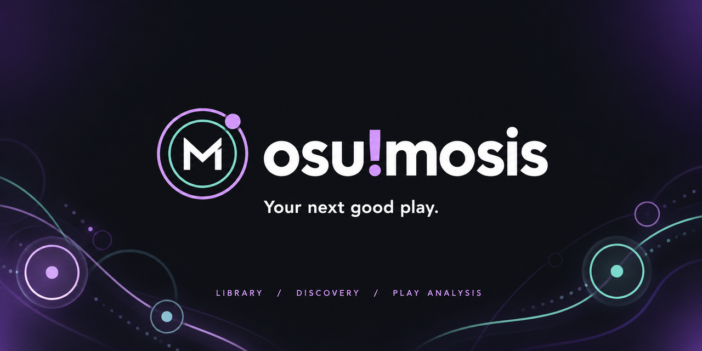

<p align="center">
  
</p>

<p align="center">
  A local osu! companion for your library, your next map and your plays.
</p>

<p align="center">
  <a href="https://github.com/Debuzzz/osumosis/actions/workflows/quality.yml"></a>
  <a href="docs/USER_GUIDE.md"></a>
  <a href="docs/DESKTOP.md"></a>
  <a href="docs/CONTRIBUTING.md#ai-assisted-and-vibe-coded-contributions"></a>
</p>

<p align="center">
  <a href="docs/USER_GUIDE.md">Get started</a> ·
  <a href="docs/DESKTOP.md">Desktop setup</a> ·
  <a href="https://github.com/Debuzzz/osumosis/issues">Issues &amp; ideas</a> ·
  <a href="docs/CONTRIBUTING.md">Contribute</a>
</p>

## What it does

- Browse osu!stable and osu!lazer libraries, collections and cached map metadata.
- Search with text, advanced filters and batches of 20 mapsets.
- Discover maps through the official osu! API, with a shared limit of **5 searches per minute**.
- Get **5 recommendations** and calculate difficulty/PP locally with mods.
- Follow tosu live and review locally recorded attempts, scores and error timelines.

Installed maps and online discoveries stay distinct. The application prioritizes local data and cache and reads game files without modifying them. English is the default interface language; French remains available in Settings.

## Quick start

Install a current Node.js LTS release (22.13+ for development), then run:

```sh
npm ci
npm run check:runtime
npm run build
npm start
```

Open **http://127.0.0.1:3000**, select your stable or lazer library in **Settings**, then index it. Close lazer before indexing. Start [tosu](https://github.com/tosuapp/tosu) on the same computer to capture gameplay.

For development, use `npm run dev`. For the desktop window, install the [Tauri prerequisites](docs/DESKTOP.md), close the browser-mode backend, then run `npm run desktop:dev`.

## Documentation

| Guide                                | Contents                                                            |
| ------------------------------------ | ------------------------------------------------------------------- |
| [User guide](docs/USER_GUIDE.md)     | Setup, library profiles, search, telemetry, storage and limitations |
| [Desktop](docs/DESKTOP.md)           | OS prerequisites, Tauri builds and installers                       |
| [osu! account](docs/OAUTH.md)        | OAuth setup, cache and token storage                                |
| [Contributing](docs/CONTRIBUTING.md) | Code checks, Windows troubleshooting and version releases           |
| [Architecture](docs/ARCHITECTURE.md) | Feature boundaries and where to change code                         |
| [Localization](docs/LOCALIZATION.md) | English source strings and adding translations                      |
| [Agent instructions](AGENTS.md)      | Repository guidance and the project development skill               |

Personalized PP-gain recommendations, historical score import and replay frame playback are still planned. Lazer schemas, real-game integrations and desktop installers need validation on the target machine. See [ROADMAP.md](ROADMAP.md) and [CHANGELOG.md](CHANGELOG.md) for progress.

## Contributions and ideas

AI-assisted and vibe-coded PRs are welcome when the changes are focused, understood and verified. See the [contributing guide](docs/CONTRIBUTING.md#ai-assisted-and-vibe-coded-contributions). For an idea that still needs a design or implementation plan, [open an issue](https://github.com/Debuzzz/osumosis/issues/new) to discuss it first; brainstorming with AI can help make the proposal clearer.
