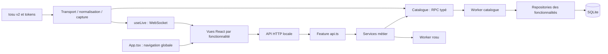

# Architecture

osu!mosis est un monolithe modulaire : un backend Node expose l’API locale, des modules par fonctionnalité définissent les responsabilités, et des workers isolent SQLite et les calculs lourds. Le frontend React utilise ces contrats en HTTP/WebSocket. Tauri fournit la fenêtre et lance le même backend.

## Repères dans le dépôt

| Dossier            | Responsabilité                                                                   |
| ------------------ | -------------------------------------------------------------------------------- |
| `server/`          | Backend Node/Fastify, fonctionnalités et stockage                                |
| `src/`             | Frontend React : vues, composants, hooks et outils                               |
| `shared/`          | Types échangés et syntaxe de recherche commune, sans dépendance frontend/backend |
| `src-tauri/`       | Fenêtre Rust, sidecar Node, fermeture et packaging                               |
| `scripts/`, `bin/` | Build, qualité, préparation desktop et lancement npm                             |
| `test/`            | Tests des profils, fichiers, catalogue, API et télémétrie                        |

## Backend

`server/index.ts` est le point d’entrée. `server/app.ts` compose Fastify et les routes. `server/core/services.ts` assemble les dépendances ; `core/lifecycle.ts` démarre et ferme le service et son marqueur. `http/` contient les protections Host/Origin, les erreurs HTTP, la diffusion WebSocket, les routes système et le service du frontend compilé.

Les modules dans `server/features/` suivent les responsabilités qui existent réellement :

- `api.ts` : routes, validation de la requête et appel du service. Chaque route déclare les dépendances qu’elle utilise avec `Pick<AppServices, ...>`.
- `service.ts` : orchestration et règles de la fonctionnalité.
- `repository.ts` : requêtes de stockage. Les repositories SQLite sont assemblés dans le worker catalogue.
- `model.ts`, `schema.ts` : données internes, transformations et validation.
- `adapters/`, `worker.ts` : intégrations aux formats du jeu et traitements isolés, lorsque nécessaires.

Un module ne reçoit pas des fichiers vides pour respecter un modèle de dossier. Par exemple, les collections ont une API et un repository ; le cache des couvertures vit dans `media/cover-cache.ts`.

| Fonctionnalité            | Fichiers à consulter                                                                     |
| ------------------------- | ---------------------------------------------------------------------------------------- |
| Bibliothèque stable/lazer | `library/service.ts`, `stable-indexer.ts`, `lazer-indexer.ts`, `adapters/`, `watcher.ts` |
| Maps et recherche         | `maps/api.ts`, `schema.ts`, `search.ts`, `repository.ts`, `model.ts`                     |
| Collections               | `collections/api.ts`, `repository.ts`                                                    |
| Plays enregistrés         | `plays/api.ts`, `repository.ts`, `model.ts`, `storage-model.ts`                          |
| Recommandations           | `recommendations/api.ts`, `repository.ts`                                                |
| Découverte osu!           | `discovery/api.ts`, `service.ts`, `model.ts`, `repository.ts`                            |
| Compte OAuth              | `account/api.ts`, `service.ts`                                                           |
| Réglages                  | `settings/model.ts`, `repository.ts`, `service.ts`, `api.ts`                             |
| Calculs de difficulté/PP  | `analysis/service.ts`, `worker.ts`, `repository.ts`                                      |
| Médias                    | `media/api.ts`, `cover-cache.ts`, `infrastructure/paths.ts`                              |
| tosu                      | `telemetry/transport.ts`, `normalizer.ts`, `service.ts`, `snapshot.ts`, `logger.ts`      |

### Catalogue et workers

`features/catalog/service.ts` est le client RPC. Son contrat `model.ts` dérive les commandes, arguments et résultats des repositories et du service d’indexation. Les messages sont corrélés par ID. Le client HTTP ne charge pas les repositories : leurs imports dans le contrat sont des imports de types.

`features/catalog/worker.ts` ouvre l’unique connexion SQLite, crée le contexte de bibliothèque et assemble les commandes. `infrastructure/database.ts` conserve les tables, index, triggers FTS5 et migrations existants. Le contexte appartient à cette instance de worker ; il n’est pas un singleton exporté. L’indexation cède régulièrement la main aux recherches pendant le scan.

`tsup.config.ts` fixe les noms des sorties : `dist/server/index.js`, `catalog-worker.js` et `analysis-worker.js`. En développement, `infrastructure/dev-worker.mjs` charge les workers TypeScript avec tsx, y compris sous Windows. Les chemins de sortie utilisés par npm et Tauri restent identiques.

### Données locales et cache

Le checksum est la clé de révision ; les IDs de map/set sont des attributs facultatifs. Une découverte sans checksum utilise `remote:<id>` jusqu’à l’indexation du fichier réel. `local` décrit la bibliothèque sélectionnée au dernier scan complet. Le changement de profil efface les indicateurs installés et conserve le cache. Les collections sont filtrées par client et dossier ; les membres absents restent référencés.

Stable lit `osu!.db` et `collection.db` sur une copie mémoire cohérente. Le lecteur binaire est séparé du parseur `.osu`, partagé avec lazer. Lazer copie la base Realm dans le stockage de l’application et ouvre uniquement cette copie en lecture seule. Les médias hashés sont résolus via les noms logiques du set. Aucun schéma du jeu n’est migré. Le scan désactive les références disparues après une traversée complète ; les fichiers connus avec une erreur de parsing conservent leurs données précédentes.

La recherche compile une syntaxe limitée vers SQL paramétré avec des colonnes/ordres autorisés. Elle filtre chaque difficulté puis groupe les sets. Le scroll charge 20 sets avec toutes leurs difficultés correspondantes ; aucun appel distant n’est déclenché par le scroll.

La découverte officielle conserve le budget partagé de cinq recherches par minute, l’espacement de douze secondes, les requêtes en cours mutualisées et les curseurs persistés. Les tokens OAuth de découverte et les tokens utilisateur sont distincts. Les couvertures passent par une file séparée et un cache borné ; la lecture du catalogue ne remplit pas implicitement le cache.

Les calculs rosu utilisent au maximum deux workers concurrents, interrompus après trente secondes. Le cache dépend du checksum, des mods, du client stable/lazer et de la version du moteur. Le résultat indique les règles utilisées.

### Capture et cycle de vie

Le transport tosu possède les sockets et leurs reconnexions. Le normaliseur convertit un paquet v2 en snapshot. Le service décide du début, du retry, du résultat et de la sauvegarde. Il reçoit un port `savePlay` et ne connaît pas SQLite. `snapshot.ts` prépare les valeurs finales à stocker ; le logger conserve des événements bornés, sans payload complet ni secret.

Le flux `/tokens` confirme partie (2) ou replay (8). Le départ attend au moins 350 ms et des valeurs cohérentes ; un reset d’horloge sans progression ne crée pas de retry. Le résultat attend 800 ms pour collecter le score final. Les replays reconnus ne deviennent pas des tentatives jouées. Les erreurs restent des différences de compteurs observées sur un intervalle. Les nouveaux plays conservent un snapshot, les anciens restent lisibles sans champs reconstruits. Le graphe live, les événements et les diagnostics restent bornés.

Le service des réglages sérialise les sauvegardes, sélectionne la bibliothèque et restaure la sélection si l’écriture échoue. Ses consommateurs lisent `current` à chaque requête : une modification est visible sans redémarrage. Il renouvelle les intégrations concernées et la surveillance stable. Lazer reste indexé manuellement depuis un jeu fermé.

## Frontend et rôle de App

`src/main.tsx` initialise React et React Query. `src/App.tsx` conserve l’état global de navigation, la collection sélectionnée, le détail ouvert, les notifications et les actions d’indexation. Il assemble les fonctionnalités et le layout ; il ne définit plus leurs composants internes.

| Responsabilité autrefois dans App                     | Emplacement                                                             |
| ----------------------------------------------------- | ----------------------------------------------------------------------- |
| Bibliothèque, requête infinie et découverte explicite | `features/library/Library.tsx`                                          |
| Recherche, modes, statuts et filtres avancés          | `features/library/components/LibraryFilters.tsx`, `MetadataFilters.tsx` |
| Carte d’un set                                        | `features/library/MapCard.tsx`                                          |
| Fiche de map et médias                                | `features/library/MapDetail.tsx`                                        |
| Simulation et affichage de strain                     | `features/library/components/MapAnalysis.tsx`                           |
| Recommandations                                       | `features/recommendations/Recommendations.tsx`                          |
| Sidebar, en-tête et pied de page                      | `components/layout/`                                                    |
| Notifications et compteurs visuels                    | `components/Toast.tsx`, `Stat.tsx`                                      |
| Connexion live et invalidation des caches React Query | `hooks/useLive.ts`                                                      |
| Navigation compacte et focus                          | `hooks/useResponsiveNavigation.ts`                                      |
| Ouverture des liens dans Tauri                        | `hooks/useDesktopLinks.ts`, `lib/desktop.ts`                            |
| Couleurs de difficulté                                | `features/library/tools/difficulty-colors.ts`                           |
| Formatage, libellés de résultats, HTTP et traduction  | `lib/`                                                                  |

Les autres vues sont également regroupées par fonctionnalité : `account`, `plays`, `settings`, `telemetry` et `releases`. Les panneaux de réglages sont des composants distincts. `plays/Plays.tsx` orchestre le mode automatique ou manuel ; `SavedPlay`, `Performance`, `Background` et `PlayTimeline` partagent le rendu des scores directs et enregistrés.

`components/` contient les éléments visuels génériques, `hooks/` les comportements React réutilisés, et `lib/` les outils indépendants des vues. Les composants peuvent dépendre des contrats `shared/`, mais jamais du backend Node. Les textes restent dans `src/locales/`, chargés par `lib/i18n.ts`.

`src/styles.css` importe les fichiers de `src/styles/` dans un ordre explicite. Le découpage préserve l’ordre de la cascade : layout, bibliothèque, recommandations, plays, réglages, détail, responsive et widgets desktop. Les classes CSS existantes sont conservées.

## Tauri et compatibilité

Tauri démarre le runtime Node compagnon, réserve le port 3000, attend `service.json` avec l’identifiant d’instance et ouvre la WebView locale. À la fermeture, il demande l’arrêt, attend le nettoyage et termine le processus si nécessaire. Les logs sont conservés dans `desktop-backend.log`.

La structure Rust et les contrats de démarrage restent compatibles avec le refactor. La préparation conserve les modules natifs, leurs licences et les workers compilés. Le manifeste de la copie embarquée omet les scripts de développement : Husky reste réservé au dépôt. Les installations de dépendances natives conservent leurs propres scripts. Le dossier de test `@fastify/send/test` et les bibliothèques mobiles Realm inutilisées sont retirés de cette copie.

Les API, la base SQLite, les fichiers de configuration, les quotas, les chemins de données et la sélection stable/lazer sont conservés. Les essais Windows avec lazer/tosu et le build des installateurs restent nécessaires pour valider la WebView et les intégrations réelles.

## Contrôles et évolution

`npm run check` vérifie lint sans avertissement, formatage, TypeScript et dépendances. Le contrôle d’architecture interdit les imports entre frontend et backend, les dépendances de `shared/` vers l’application, les dépendances métier vers la composition et les cycles d’import runtime. Les fichiers applicatifs TypeScript sont limités à 450 lignes hors commentaires/lignes vides pour encourager un découpage continu.

Les hooks de commit/push et la CI utilisent les mêmes commandes. Le push vérifie aussi les tests et le build de production, dont les noms de workers sont fixés. Voir [CONTRIBUTING.md](CONTRIBUTING.md) pour modifier une fonctionnalité et comprendre les contrôles.
