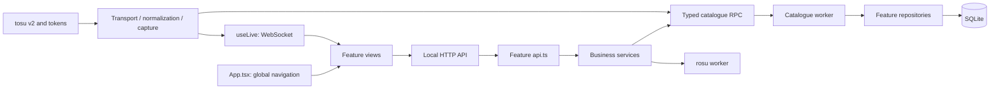

# Architecture

osu!mosis is a modular monolith. A Node backend exposes a local API, feature modules own behavior, and workers isolate SQLite and expensive calculations. React consumes HTTP/WebSocket contracts; Tauri provides the window and launches the same backend.

## Repository map

| Directory                      | Responsibility                                                   |
| ------------------------------ | ---------------------------------------------------------------- |
| `server/`                      | Node/Fastify backend, features and persistence                   |
| `src/`                         | React views, components, hooks and tools                         |
| `shared/`                      | Shared types/search syntax without application imports           |
| `src-tauri/`                   | Rust window, Node sidecar, shutdown and packaging                |
| `scripts/`, `bin/`             | Build, quality, desktop preparation and npm startup              |
| `test/`                        | Profile, file, catalogue, API, localization and telemetry checks |
| `.agents/skills/`, `AGENTS.md` | Project skill and repository instructions for agents             |

## Backend

`server/index.ts` is the entry point. `server/app.ts` composes Fastify and registers routes. `core/services.ts` assembles dependencies; `core/lifecycle.ts` manages startup, shutdown and the service marker. `http/` owns Host/Origin protection, HTTP errors, WebSocket broadcasting, system routes and compiled frontend serving.

Feature files follow actual responsibilities:

- `api.ts`: routes, request validation and service calls, with explicit `Pick<AppServices, ...>` dependencies.
- `service.ts`: orchestration and business rules.
- `repository.ts`: storage queries, assembled inside the catalogue worker.
- `model.ts`, `schema.ts`: internal data, transformations and validation.
- `adapters/`, `worker.ts`: game-format integration and isolated work when needed.

Avoid empty layers added only for naming symmetry. Collections need an API and repository; the cover cache belongs in `media/cover-cache.ts`.

| Feature              | Files under `server/features/`                                                        |
| -------------------- | ------------------------------------------------------------------------------------- |
| Stable/lazer library | `library/service.ts`, indexers, `adapters/`, `watcher.ts`                             |
| Maps/search          | `maps/api.ts`, `schema.ts`, `search.ts`, `repository.ts`, `model.ts`                  |
| Collections          | `collections/api.ts`, `repository.ts`                                                 |
| Saved plays          | `plays/api.ts`, `repository.ts`, `model.ts`, `storage-model.ts`                       |
| Recommendations      | `recommendations/api.ts`, `repository.ts`                                             |
| Online discovery     | `discovery/api.ts`, `service.ts`, `model.ts`, `repository.ts`                         |
| OAuth account        | `account/api.ts`, `service.ts`                                                        |
| Settings             | `settings/model.ts`, `repository.ts`, `service.ts`, `api.ts`                          |
| Difficulty/PP        | `analysis/service.ts`, `worker.ts`, `repository.ts`                                   |
| Media                | `media/api.ts`, `cover-cache.ts`; shared boundary helper in `infrastructure/paths.ts` |
| tosu                 | `telemetry/transport.ts`, `normalizer.ts`, `service.ts`, `snapshot.ts`, `logger.ts`   |

### Catalogue and workers

`features/catalog/service.ts` is the RPC client. `model.ts` infers commands, parameters and results from repositories and the indexing service. Messages use correlation IDs; repository references in the contract are type-only imports, so HTTP code does not load storage modules.

`features/catalog/worker.ts` opens the single SQLite connection, creates the library context and assembles commands. `infrastructure/database.ts` owns tables, indexes, FTS5 triggers and migrations. Context belongs to a worker instance rather than an exported singleton. Indexing yields to searches during a scan.

`tsup.config.ts` preserves flat output names: `dist/server/index.js`, `catalog-worker.js` and `analysis-worker.js`. In development, `infrastructure/dev-worker.mjs` loads TypeScript workers through tsx, including on Windows. npm and Tauri share these output contracts.

### Local data and cache

Checksum identifies a map revision; map/set IDs are optional attributes. A discovery without checksum uses `remote:<id>` until a real file is indexed. `local` refers to the selected library's last complete scan. Changing profiles clears installed flags while retaining cache. Collections are scoped to client/folder and retain references to missing members.

Stable reads `osu!.db`/`collection.db` from memory snapshots; its binary reader is separate from the `.osu` parser shared with lazer. Lazer copies Realm into application storage and opens only the read-only copy. Hashed media resolves through logical set filenames. Game schemas are never migrated. Completed scans deactivate missing files; known files with parsing errors retain earlier metadata. Resolve storage roots and files canonically before physical boundary checks, including Windows aliases/junctions.

Search compiles a restricted syntax into parameterized SQL with allowlisted columns/orders. It filters difficulties before grouping sets. Infinite scroll adds 20 complete sets and never makes an online request.

Official discovery shares a five-searches-per-minute budget with twelve-second spacing, deduplicated in-flight requests and persisted cursors. Discovery and user OAuth tokens are separate. Covers use their own bounded queue/cache; browsing cached data does not implicitly populate it.

rosu calculations allow two concurrent workers with a thirty-second timeout. Cache keys include checksum, mods, stable/lazer client and engine version. Results identify the scoring rules used.

### Capture and lifecycle

The tosu transport owns sockets/reconnects; the normalizer turns v2 packets into snapshots; the service decides start, retry, result and save behavior. It receives a `savePlay` port without knowing SQLite. `snapshot.ts` prepares stored results; the logger writes bounded events without complete payloads or secrets.

`/tokens` confirms gameplay (2) or replay (8). Capture start waits at least 350 ms for consistent values; a clock reset without progress is not a retry. Results wait 800 ms for final score data. Recognized replays do not create played attempts. Errors remain observed counter differences over intervals. New plays retain snapshots; old captures remain readable without reconstructed values. Live graphs, events and diagnostics are bounded.

Settings writes are serialized, select the library and roll back selection after a failed write. Consumers read `current` per request, so saved settings take effect without restarting. Integrations and stable watching are renewed as needed; lazer indexing stays manual with the game closed.

## Frontend and App

`src/main.tsx` initializes React and React Query. `App.tsx` owns global navigation, selected collection/detail, notifications and indexing actions. It composes feature views and layout rather than defining their internal components.

| Responsibility                                 | Location under `src/`                                                   |
| ---------------------------------------------- | ----------------------------------------------------------------------- |
| Library, infinite query and explicit discovery | `features/library/Library.tsx`                                          |
| Search/modes/status/advanced metadata filters  | `features/library/components/LibraryFilters.tsx`, `MetadataFilters.tsx` |
| Set card and map details                       | `features/library/MapCard.tsx`, `MapDetail.tsx`                         |
| PP/strain simulation                           | `features/library/components/MapAnalysis.tsx`                           |
| Recommendations                                | `features/recommendations/Recommendations.tsx`                          |
| Sidebar/topbar/footer                          | `components/layout/`                                                    |
| Generic visuals                                | `components/Toast.tsx`, `Stat.tsx`, `Dialog.tsx`, `Chart.tsx`           |
| Live socket and React Query invalidation       | `hooks/useLive.ts`                                                      |
| Compact navigation and focus                   | `hooks/useResponsiveNavigation.ts`                                      |
| Tauri link handling                            | `hooks/useDesktopLinks.ts`, `lib/desktop.ts`                            |
| Difficulty colors                              | `features/library/tools/difficulty-colors.ts`                           |
| Formatting, outcomes, HTTP and translation     | `lib/`                                                                  |

Other feature views cover account, plays, settings, telemetry and releases. Settings panels are separate components. `plays/Plays.tsx` selects automatic/manual mode; `SavedPlay`, `Performance`, `Background` and `PlayTimeline` share live and recorded score rendering.

`components/` holds generic visuals, `hooks/` reusable React behavior and `lib/` view-independent tools. Frontend modules may use `shared/` contracts but never import Node backend code. English is the source/default/fallback resource in `locales/en.json`, with French in `fr.json` under matching English keys. Language preferences, HTML `lang` and regional formatting are managed in `lib/i18n.ts`; see [LOCALIZATION.md](LOCALIZATION.md).

`styles.css` imports `styles/` in an explicit cascade order: layout, library, recommendations, plays, settings, detail, responsive and desktop widgets. Preserve that order and existing classes when changing styles.

## Tauri and compatibility

Tauri starts the Node sidecar on port 3000, waits for the instance-specific `service.json` marker and opens the local WebView. Closing the window requests shutdown, waits for cleanup and terminates the process if needed. Output is logged in `desktop-backend.log`.

Desktop preparation retains native modules, licenses and compiled workers. The staged manifest omits development scripts to keep Husky out of packaging while retaining dependency install scripts. Only staged Realm mobile libraries and `@fastify/send/test` fixtures are pruned.

SQLite/configuration formats, quotas, storage paths and stable/lazer selection are shared across browser and desktop workflows. Real Windows lazer/tosu, WebView and installer validation is still required.

## Quality and evolution

`npm run check` checks warning-free lint, formatting, types, boundaries and versions. Architecture checks reject frontend/backend imports, `shared/` dependencies on application code, runtime feature dependencies on composition and runtime import cycles. Application TypeScript modules are limited to 450 nonblank/noncomment lines.

Git hooks and CI use the same checks; push also runs tests and production builds. See [CONTRIBUTING.md](CONTRIBUTING.md) for development and synchronized releases.
